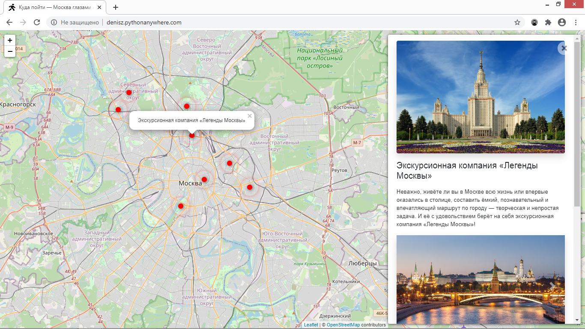

# Интерактивная карта Москвы

[Демка сайта](http://denisz.pythonanywhere.com/).

## Запуск

- Скачайте код
- Установите зависимости командой `pip install -r requirements.txt`
- Создайте БД командой `python3 manage.py migrate`
- Запустите сервер командой `python3 manage.py runserver`

## Как добавить данные
(Данные хранятся в папке *media/data* в формате *.json*)
- Добавить файл: запустите команду `python3 manage.py load_place "http://denisz.pythonanywhere.com/media/data/Антикафе Bizone"`

## Переменные окружения

Часть настроек проекта берётся из переменных окружения. 
Чтобы их определить, создайте файл `.env` рядом с `manage.py` 
и запишите туда данные в таком формате: `ПЕРЕМЕННАЯ=значение`.

Доступные переменные:
- `DEBUG` — дебаг-режим. Поставьте `True`, чтобы увидеть отладочную информацию в случае ошибки.
- `SECRET_KEY` — секретный ключ проекта
- `SESSION_COOKIE_SECURE` - Использовать ли безопасный cookie для cookie сеанса. Поставьте `True`
- `CSRF_COOKIE_SECURE` - Использовать ли безопасный файл cookie для файла CSRF. Поставьте `True`

## Цели проекта

Код написан в учебных целях. Это урок в курсе по Python 
и веб-разработке на сайте [Devman](https://dvmn.org/modules/django/lesson/yandex-afisha).
